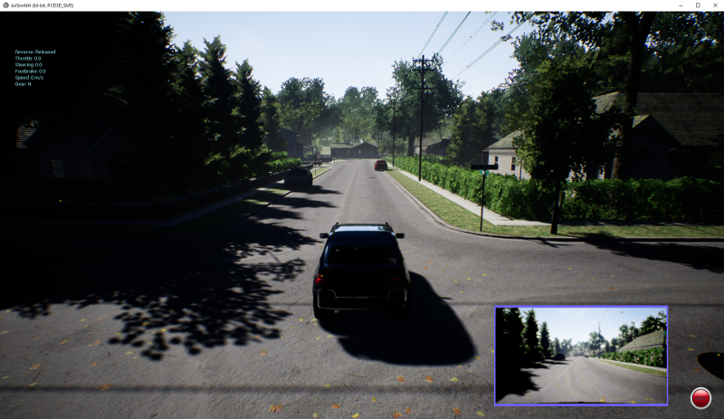

This repository contains Python scripts showing how you can use [Microsoft AirSim](https://github.com/Microsoft/AirSim) to collect image data
from a moving vehicle, then use that data to train and test a deep-learning neural net in TensorFlow. This repository also contains Python scripts 
to simulate the collision of two cars 

# Prerequisites

* [Recommended hardware](https://wiki.unrealengine.com/Recommended_Hardware) for running UnrealEngine4, required
for AirSim.  Although it is possible build AirSim on OS X and Linux, we found
it easiest to use the pre-compiled Windows binaries in the
[Neighborhood](https://github.com/Microsoft/AirSim/releases/download/v1.1.7/Neighbourhood.zip)
example.

* [Python3](https://www.python.org/ftp/python/3.6.3/python-3.6.3-amd64.exe) for 64-bit Windows

* [TensorFlow](https://www.tensorflow.org/install/install_windows). To run TensorFlow on your GPU as we and
most people do, you'll need to follow the 
[directions](https://www.tensorflow.org/install/install_windows) for installing CUDA and CuDNN.  We recommend setting aside at least an hour to make sure you do this right.

# Instructions
### collison_testing

1. Clone this repository.
2. Download and unzip the [AirSimNH](https://github.com/microsoft/AirSim/releases/download/v1.7.0-windows/AirSimNH.zip)
example, open it, and click <b>run.bat</b> to launch AirSim.  
3. When prompted, go with the default car simulation. If you press the <b>3</b> key on your keyboard,
you will see the little image on which the neural net will be trained.
4. From the repository, run the <b>image_collection.py</b> script.  It will start the car moving and stop when the
car collides with the fence, creating a <b>carpix</b> folder containing the images on which you will train 
the network in the next step.
5. From the repository, run the <b>collision_training.py</b> script.
6. From the repository, run the <b>collision_testing.py</b> script.  This should drive the car forward as before, but 
but the car should stop right before it hits the fence, based on the collision predicted by the neural net.

### CollisonAvoidance
1. run AirSimNH envirnment
2. run CollsionAvoidance.py

# How it works
### collison_testing
The <b>image_collection</b> script maintains a queue of the ten most recent images and saves them to numbered
files in the <b>carpix</b> folder.  The <b>collision_training</b> script converts these color images to
grayscale, then builds a training set in which all images but the final one are labeled as safe (no
collision; code <tt>[1 0]</tt>), and the final one is labeled as a collision (code <tt>[0 1]</tt>).  
Finally, this training script uses Python's built-in <tt>pickle</tt> library to 
[save](https://github.com/simondlevy/AirSimTensorFlow/blob/master/collision_training.py#L111-L113)
the trained network parameters (weights and biases).  The <b>collision_testing</b> script uses <tt>pickle</tt> to
[restore](https://github.com/simondlevy/AirSimTensorFlow/blob/master/collision_testing.py#L42-L45)
these parameters, then reconstructs the TensorFlow [neural net](https://github.com/simondlevy/AirSimTensorFlow/blob/master/tf_softmax_layer.py#L18-L28) from them.  (We found this approach easier than
using TensorFlow's [save-and-restore](https://www.tensorflow.org/programmers_guide/saved_model) API.)
Finally, the <b>collision_testing</b> script moves the vehicle forward, converting the live 
image into grayscale and running it through the network to make a collision/no-collision prediction.
When the value of the &ldquo;collision bit&rdquo; exceeds 0.5, the script stops the vehicle by applying the brakes.

### CollisonAvoidance
To be finished

